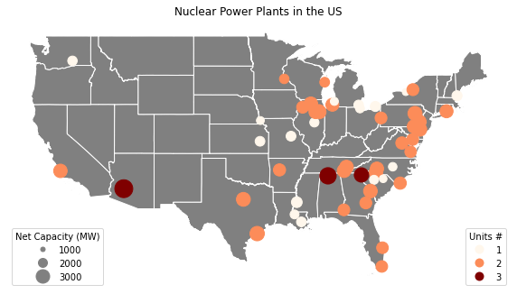
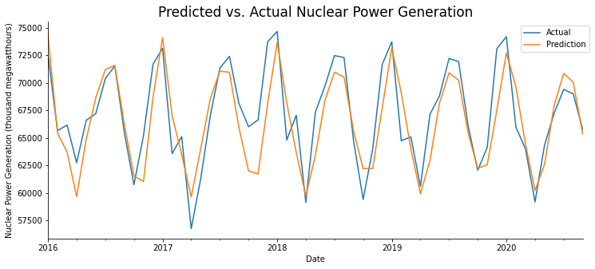

# Nuclear Power Generation in the U.S.

#### Jeong Lim Kim and Jayoung Kang \| PPHA 30536: Data and Programming for Public Policy II

## ***Project Overview***

This project is aimed at understanding the current status and trend of nuclear share of electricity net generation in the United States. Electricity generation by nuclear power plant is a contested topic around the globe. Growing concerns on air pollution and nuclear safety have led policy makers to implement a nuclear power phase-out. Thus, in order to predict the future trend of nuclear generation in the U.S., we have examined the historical trend and current status of nuclear generation. We have employed the following approaches in programming our final project:

*a) Understanding current status of nuclear power plants*

We first mapped the location of the current operating nuclear power plants through web-scraping the table that contains the location of operating nuclear power plants in the United States byusing **BeautifulSoup** and plotting it onto the U.S. map through **geopandas**.

*b) Understanding the historical trend of electricity power generation in the U.S.*

In order to understand the historical trend of electricity power generation in the U.S., we have developed a stacked bar graph that displays monthly net electricity generation from five energy sources -- coal, natural gas, nuclear, conventional hydroelectric, and wind. To analyze if climate change has any correlation with net electricity generation, we merged the data on national average temperature from year 2001 to 2020 with the net electricity generation data and visually display the relationship between two elements. Through **bokeh**, we have provided a hover tool to inspect the data. The legends are also interactive, allowing the audience to click on specific data he wishes to focus on visually.

*c) Predicting future nuclear power generation*

In order to fit a model to predict nuclear power generation, we conducted two types of regression. The first regression was a linear regression, using the monthly energy generated from other sources (coal, natural gas, hydroelectricity, wind) as well as the monthly average climate in the U.S. as the x-variables. We used the climate data because we hypothesized that energy production in general would be linked to climate levels. However, since our data was a time-series data, we also ran an autocorrelation with twelve lags in order to account seasonality. In order to run the autocorrelation, we utilized the **statsmodels** package. For both models, we split the data in the training and testing data by the date, so that data from 2001 to 2015 were used as training data and data from 2016 to 2020 was used as testing data.

## ***Data Usage***

In order to conduct the final project, the data we utilized consist of the following:

*a) Wikipedia page with location data of operating nuclear power plants in the U.S.*

    https://en.wikipedia.org/wiki/List_of_nuclear_power_stations

*b) Cartographic boundary files from the U.S. Census Bureau*

    https://www.census.gov/geographies/mapping-files/time-series/geo/carto-boundary-file.html

*c) U.S. Energy Information Administration*

    https://www.eia.gov/beta/states/data/dashboard/electricity

*d) National Climatic Data Center*

    https://www.ncdc.noaa.gov/cag/national/time-series

## ***Output and Results, Key Findings***

*a) Mapping Nuclear Power Plants in the U.S.*

Our output map of the nuclear power plants shows that the majority of the plants are located on the East coast and few are located on the West coast. Most of the power plants are composed of two units, as denoted by the color coding of the plot. It is possible that more reactors are located on the East coast and the Midwest than the West coast because it is less prone to earthquakes that would likely pose safety issues to the operation of nuclear reactors. The marker size of each location denotes the size of the net capacity of each power plant.

*b) Plotting monthly net electricity generation by energy source with average temperature*

Our graph displays trends and patterns of energy consumption from January 2001 to September 2020. We merged the national average temperature with net electricity generation to examine the relationship between the two components. One of the most noticeable patterns from the graph is that the average temperature and the net electricity generation works in the same direction. Moreover, in the early 2000s, coal has shown to be the primary energy source for electric power generation followed by nuclear. Since the 2010s, natural gas seems to rapidly overtake coal. In the late 2010s, natural gas overtook coal and became the leading source of electricity in the United States. It is also visible that an increase in renewable electricity generation takes place in this time frame, especially wind.

*c) Fitting models for nuclear power generation*

The first model fitted, the linear regression with the y-variable as the electricity generation from nuclear power and the x-variables as the climate data and electricity generated from other sources, did not provide a good model for predicting the test data. When predicting the results for the testing data using the model fitted from the training data, the R^2^ returned -1.09515, indicating that the model performed worse than fitting a horizontal line. Since based on our interactive map, we could observe that there was an observable seasonality in the data where a pattern appeared to occur annually. Thus, we fitted a new model utilizing an autocorrelation instead. The R^2^ for the autocorrelation returned a value of 0.68542 showing that this model performed better in predicting the testing data based on the model fitted from the training data. We also created a graph that compared the results from the predicted nuclear power generation to the actual generation from the testing data. This gave a visual representation that showed the prediction to performrelatively well except for the last couple of months in 2017. In order to overcome the limitations of the fitted autocorrelation, we could fit a model where we take into account other data such as government policy or where we account for seasonality using periodic functions that use sine and cosine terms.
