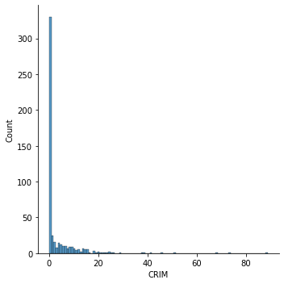
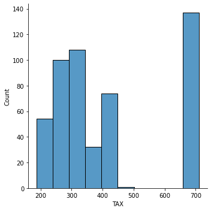

### Linear Regression

\<Introduction to Statistical Learning Chapter 2\>

**Question 3**: It is a general rule that variance increase and bias decrease as we use more flexible methods. Variance has a positive exponential curve since variance refers to the change in the amount of $\hat f$ when we estimated it using a different training data set. Changing any one of the data points may cause the estimate $\hat f$ to change considerably. On the other hand, typical (squared) bias refers to the error due to simplifying complicated problems to much easier, more manageable model. Thus, as we add more complexity to our model, our bias in the estimate of $\hat f$ generally decreases. The training error generally decreases as flexibility increases because complexity of a model allows $f$ curve to fit the observed data more closely. The test error forms a positive quadratic curve because test error decreases when the flexibility increases until an increase in flexibility overfits the data increasing the test error. Bayes error or their reducible error is shown as a vertical line, greater than zero because the Bayes classifier produces the lowest possible test error rate. The curve lies below the test error curve because the test error will always be greater than the irreducible error.

**Question 5**: One advantage of a more flexible (non-parametric) approach is its accuracy. Non-parametric models accurately fit a wide range of possible shapes of $f(x)$, decreasing bias. However, one of the disadvantages is that it often requires a large sample to avoid overfitting the training data and increase in variance. A parametric model (less flexible approach), on the other hand, is easier to interpret as it simplifies the problem of estimating $f(x)$. Preference of each methods depends on the goal of our statistical modeling -- prediction or inference. A more flexible approach would be preferred if our goal is to predict our result. A less flexible approach would be preferred if our goal is to infer and interpret our result.

**Question 10**:

a) There are 506 rows and 14 columns. Each row represents housing values in suburbs of Boston. Columns represent attributes that may affect in housing values.

b) Pairwise scatter plots of all predictors:

When we pair-plot all the predictors, we can visually see that some predictors are highly correlated to one another, while some predictors don't clearly display it. However, there are limitations to describe the relationships between predictors. Further statistical tests are necessary to conclude relationships between variables.

c) If we examine our plots above, there are some predictors that seems to have an
association with per capita crime rate, but some are not obvious. For example, we can
take a closer look at the relationships between 'CRIM' and 'AGE', 'DIS', 'TAX', and
'PTRA TIO'.

The plot shows positive relationships between 'CRIM' (per capital crime rate by town) and
'AGE' (proportion of owner-occupied units built prior to 1940). Older a house gets, there
seems to be more crime.There is a negative relationship between 'CRIM' and 'DIS' (weighted distances to five Boston employment centres). If a house is closer to work centers, crime decreases. However, the relationship between 'CRIM' and 'TAX' (full-value property-tax rate per
\$10,000) and 'CRIM' and 'PTRATIO' (pupil-teacher ratio by town) is not clear in pairwise
plots.

d)

Crime rate is highly negatively skewed. Most suburbs of Boston appear to have
particularly lower crime rate. However, a long tail that ranges more than 80 per capita
crime rate shows there are areas where it experiences high crime rate.

Property tax rate is largely divided into two. Lower tax rate ranges approximately from
100 to 500, and higher tax rate peaks around 650 to 700 (in \$10,000).

Although the pupil-teacher ratio is bit skewed towards left, it is generally more evenly distributed across the suburbs. The range stretches from approximately 5 to 22.

e) There are **36 suburbs** in the data set bound the Charles river.

f) The median pupil-teacher ratio is **19.05.**

g) Suburb index **398** has the lowest median value of owner-occupied homes of 5. Suburb index 398 had crime rate at 38.35, property tax rate at 666, and pupil-teacher ratio of 20.2. Comparing these values to the histograms plotted above, the crime rate is greater than the majority; property tax rate is considered high; and pupil-teacher ratio falls under the peak.

h)

64 suburbs average more than 7 rooms per dwelling, and 13 suburbs average more than 8
rooms per dwelling. Suburbs that average more than eight rooms per dwelling significantly decreases. This can also be visualized by histogram below.
