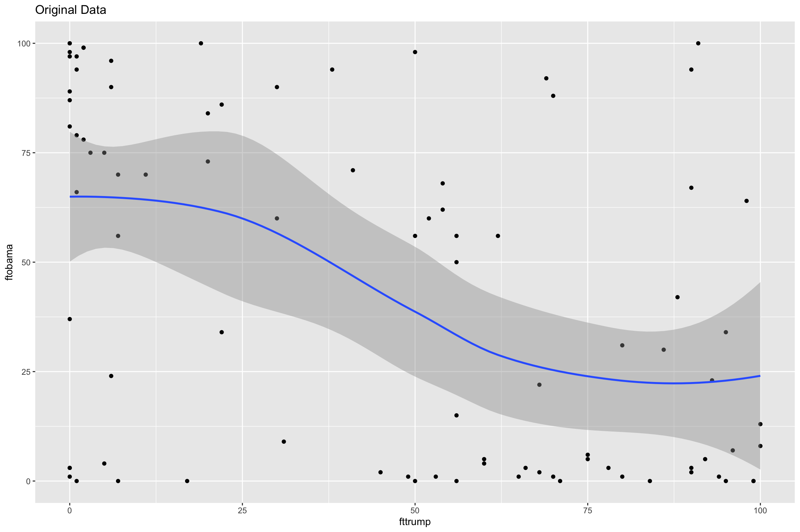
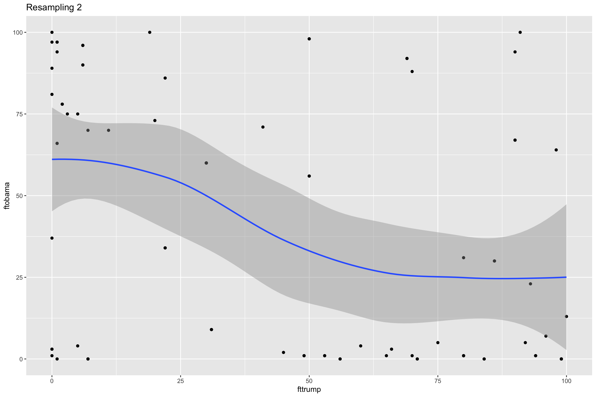

## Resampling Using Boostrapping

### Bias & Variance

1.  Consider the following eight plots based on model fits, assuming the data generating process, $$y = x^3 - 2x^2 + 1.5x + \epsilon.$$ Specifically, the figure shows two different fits of a model (one for each row) on each of the four samples (one for each column). So, e.g., column 1 shows two versions of a model fit to the same sample of 100 observations, which were drawn at random from the data generating process in the equation above. *Describe the difference between the two models in terms of complexity, bias, and variance. Responses should be at least a few sentences.*

-   In terms of complexity, the top row took a less complex, less flexible (parametic) approach than the bottom row. The parametric model above has lower variance, yet higher bias than the non-parametric model below. The bottom row is more complex, capture a lot more noise, causing high variance, but their bias is lower than the top row. The figure is a good example of bias-variance trade off.

2.  Building on the previous question and considering the following figure from ch. 2 of the ISL book, think about training and test error moving from a less flexible model towards more a more flexible model. Specifically, the figure is becoming more "flexible" as the number of neighbors, $k$, decreases, thereby picking up more local behavior. We haven't yet covered kNN or other supervised classifiers, but the logic of the figure should be apparent, where the level of flexibility of a model will directly influence training and testing error. *Explain why these two curves have the shapes they do. Responses should be at least a few sentences.*

-   Accoridng to the ISLR, as K grows, the method becomes less flexible and produces a decision boundary that is close to linear. The training error generally decreases as flexibility decreases because complexity of a model allows f curve to fit the observed data more closely. On the other hand, the test error has a U-shaped curve, where it decreases as the flexibility increases until it starts to increase at a point where a method becomes too flexible and start to capture too much noise, leading to overfitting.

3.  When the sample size, $n$, is very large, and the number of predictors, $p$, is small, would we expect the performance of a flexible model to be better or worse than an inflexible method? Justify your answer.

-   We expect the performance of a flexible model to be *better* than an inflexible method. With a sample size very large, a flexible model will be able to fit the data closer with higher chance of avoiding overfitting.

4.  When the number of predictors, $p$ is very large, and the sample size, $n$, is small, would we expect the performance of a flexible model to be better or worse than an inflexible method? Justify your answer.

-   We would expect the performance of flexible model to be *worse* than an inflexible mpdel. As we add more predictors to the model, the complexity of a model increases. The more predicotrs we add, the more precise our estimates of the mean will be. However, we will be averaging over fewer and fewer observations in each cell. Added onto it, a small sample size will results in overfitting concerns.

5.  When the relationship between the predictors, $\mathbf{X}$, and response, $y$, is highly non-linear, would we expect the performance of a flexible model to be better or worse than an inflexible method? Justify your answer.

-   A flexible model will perform *better* than an inflexible method. A flexible model could capture more complex, highly non-linear relationships. Less flexible model can produce just a relatively small range of shapes to estimate f.

6.  Why can minimizing the training mean squared error (MSE) lead to overfitting? *Responses should be at least a few sentences.*

-   Generally, the training mean squared error decreases as flexibility increases. To minimize the MSE, we could add more complexity into our model. However, fitting a more flexible model requires estimating a greater number of parameters that can lead to overfitting. Overfitting happens because our statistical learning procedure picks up patterns that are just caused by random chance rather than by true properties of the unknown function f.

7.Recall bootstrapping involves a process of drawing random samples of size $n$ through sampling *with* replacement. Using the 2016 ANES data we've used a few times already, create and plot two bootstrapped samples manually (i.e., *not using a function like `boot()`*). For reference, also plot the original data set to compare distributions of feelings toward Trump (`fttrump`) versus feelings toward Obama (`ftobama`). *Note:* When loading the ANES data, you may simply drop the `NA`s, rather than impute, for ease (though in practice, this strategy isn't recommended).

```{r}
library(tidyverse)
library(dplyr)
library(here)
library(ggplot2)

rm(list=ls())
anes <- read_csv("anes_pilot_2016.csv")
anes <- anes %>% drop_na()

set.seed(1234)

sample_1 <- sample_n(anes, nrow(anes), replace = TRUE)
sample_2 <- sample_n(anes, nrow(anes), replace = TRUE)


ggplot(anes, aes(x = fttrump, y = ftobama)) +
       geom_point() + ggtitle("Original Data") + geom_smooth()
ggplot(sample_1, aes(x = fttrump, y = ftobama)) + 
       geom_point() + ggtitle("Resampling 1") + geom_smooth()
ggplot(sample_2, aes(x = fttrump, y = ftobama)) +
       geom_point() + ggtitle("Resampling 2") + geom_smooth()

```






8.  Discuss the distributions from the previous question. Do they look mostly similar as is expected by sampling with replacement? Why or why not, do you think? Respond with a few sentences.

-   The distributions from the previous questions look mostly similar as it is expected by sampling with distribution. This is because bootstrapping obtain distinct data sets by repeatedly sampling observations from the original set. The 0.632 rule in bootstrapping allows us to observe that on average, random resampling with replacement results in 63.2% of the original sample in each bootstrap data sets.

9.  The median for feelings toward Obama (ftobama) is 39.5. Using a package or any function/method you'd like, bootstrap the standard error of our statistic of interest (which is the median in this case) based on 1000 draws from the data. You might consider writing a simple helper function to speed along the bootstrapping process, but this is up to you of course. Then, construct the 95% confidence interval around your bootstrapped estimate. Report your results and offer a few points of discussion. Respond with a few sentences.

```{r}
library(boot)
median(anes$ftobama)

boot_ftobama <- boot(anes$ftobama, function(x,i) median(x[i]), R=1000)
boot_ftobama

mean(boot_ftobama$t) 
median(anes$ftobama)+2.352

boot.ci(boot_ftobama, conf = 0.95, type = c('norm', 'basic', 'perc'))
```

-   When we bootstrap the standard error of our statistic of interest based on 1000 draws from the data, bias comes out to be approximately 2.352 with standard error of approximately 13.506. When we construct 95% confidence interval around the boostrapped estimate, the confidence interval for percentitle is measured (15.00, 62.00). While the median for feeling towards Obama in the original data is 39.5, the mean of our median for ftObama in our bootstrap is approximately 41.413. The bootstrap distribution and the sample may disagree systematically that could create bias.

10.How are bootstrapping and cross-validation approaches to resampling different? How are they similar? Why does any of this matter from both social science and computational modeling perspectives? \* Bootstrapping ad cross-validation are two most commonly used resampling methods. Cross-validation can be used to evaluate performance of given statistical learning method or to select the appropriate level of flexibility.On the other hand, bootstrap is most commonly use for quantifying uncertainty associated with some estimator, providiing a measure of accuracy of a parameter estimate. One of the main differences between bootstrapping and cross-validation is bootstrapping method resamples with replacement, while cross-validation does not. Bootstrapping and cross-validation are significant scientific techniques in both social science and computational modeling perspectives. When we apply statistical learning methods to real-world problems, we cannot possibly draw samples repeately from the population or obtain data from every individual. In the absence of an extremely large data sets, bootstrapping and cross-validation approahces can be used to measure uncertainty and evaluate performance of a model and draw plausible conclusions of a population.
