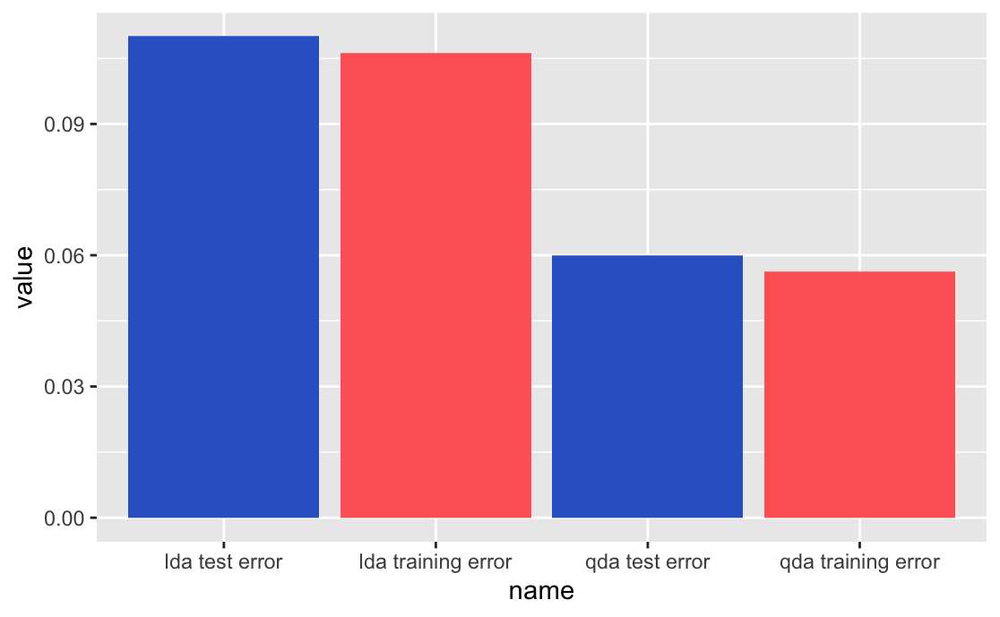

## LDA and QDA Analysis

### A Theoretical Problem

1.  (25 points) In classification problems, we minimize the generalization ("test") error rate by a simple classifier that assigns each observation to the most likely class given some set of input/predictor features, $$\Pr(Y = j | X = x_0),$$ where $x_0$ is the test observation and each possible class is represented by $j \in \{1, \dots, J\}$, which in the binary context is $\{0,1\}$. The formula above is the **Bayes classifier**, which represents the conditional probability that $Y = j$, given the observed predictor value $x_0$. In the binary context, the Bayes classifier corresponds to predicting $j = 1$ $\textrm{if}$ $\Pr(Y = 1 | X = x_0) > 0.5$, else $j = 0$.

*If the Bayes decision boundary is non-linear, then, would we expect LDA or QDA (both based on the Bayes classifier) to perform better on the training set? What about on the test set?*

Answer this question with a simulation exercise. That is, follow the steps below and be sure to **numerically** and **visually** present error rates for both classifiers. Use this evidence to support your answer.

Repeat (simulate) the following process 1000 times (hint: I'd consider writing a function to make your simulation simpler to run, but of course this is up to you.):

a.  Create a dataset with $n = 1000$, with two input features, $X_1, X_2 \sim \text{Uniform}(-1, +1)$. Also, create a response, $Y$, and let it be binary defined by $f(X) = X_1 + X_1^2 + X_2 + X_2^2$, where values 0 or greater are coded `TRUE` and values less than 0 or coded `FALSE`. Note: your $Y$ is a function of the Bayes decision boundary ($X_1 + X_1^2 + X_2 + X_2^2$, as this non-linear model defines separation between the two classes), plus some error.
b.  Randomly split your data into 80/20% training/test sets, respectively.
c.  Train LDA and QDA classifiers.
d.  Calculate each model's training and test error rate, based on your trained model from the previous step.

```{r}
set.seed(12345)
for (i in 1:1000){
  #a
  x1 <- runif(n = 1000, min= -1, max = 1)
  x2 <- runif(n = 1000, min= -1, max = 1)
  y_const <- x1 + x1^2 + x2 + x2^2 
  y <- ifelse(y_const >=0, TRUE, FALSE)
  
  df <- data.frame(y, x1, x2)
  
  #b
  split <- initial_split(df,
                       prop = 0.8) 
  train <- training(split)
  test <- testing(split)
  
  #c
  lda_mod <- lda(y ~ ., 
               data = train)
  qda_mod <- qda(y ~ ., 
               data = train)

  #d
  #LDA
  lda_pred_train <- lda_mod %>% 
    predict(train)
  lda_trainingerror <- 1-mean(lda_pred_train$class == train$y) 
  
  lda_pred_test <- lda_mod %>% 
  predict(test)
lda_testerror <- 1-mean(lda_pred_test$class == test$y)

  #QDA
  qda_pred_train <- qda_mod %>% 
    predict(train)
  qda_trainingerror <- 1-mean(qda_pred_train$class == train$y)
  
  qda_pred_test <- qda_mod %>% 
    predict(test)
qda_testerror <- 1-mean(qda_pred_test$class==test$y)
}

```

e.  Present results (error rates for both sets of data and both classifiers) **visually** and **numerically**

```{r}
lda_trainingerror
lda_testerror

qda_trainingerror
qda_testerror

error_rates <- data.frame(
  name=c('lda training error', 'lda test error', 'qda training error', 'qda test error'),  
  value=c(lda_trainingerror, lda_testerror, qda_trainingerror, qda_testerror)
  )

# Barplot
ggplot(error_rates, aes(x=name, y=value)) + 
  geom_bar(stat = "identity", fill=c("#FF6666", "#3366CC", "#FF6666", "#3366CC"))

```



f.  Offer a *few sentence discussion* after results both answering the question and discussing differences in LDA and QDA approaches to classification in non-linear contexts like this.

-   I predicted that the test error rate for the QDA would be smaller than the LDA because y is non-linear. LDA assumes every class k has the same covariance matrix while QDA estimates separate covariance matrix for each class. Looking at the results above, my prediction seems corret. Because we have created a dataset n=1000, out training set became big which recommends the QDA than the LDA.

## An Applied Problem

For this applied problem, we will return to the 2016 ANES pilot study. Using these data, you will solve the classic political problem: predict party affiliation as a function of feelings toward a variety of things, concepts, and people as well as respondents' self-reported ideologies. The theoretical assumption here is that concepts indirectly related to one's party affiliation actually drive their party affiliation. Thus, we should be able to predict party affiliation as a function of non-partisan concepts. This is certainly debatable, and thus it's a perfect task for classification.

2.  Answer the following questions, taking care to *discuss results and output at a technical and substantive level throughout* (e.g., what do ROC curves tell us and why? What are their relationships to AUC? What do the functional forms of different classifiers tell us about the quality of the solutions we get? What do the patterns *substantively* mean for our goal of predicting party affiliation? And so on.)

<!-- -->

a.  Load the data.

```{r, results = 'hide'}
anes <- read_csv("anes_pilot_2016.csv")
```

b.  Preprocess the data to:
    -   keep only four feeling thermometers for major 2016 politicians (2 extreme and 2 moderate from each party: `fttrump`, `ftobama`, `fthrc`, `ftrubio`), ideology on a five point scale (`ideo5`) party id (`pid3`)
    -   recode party to a dichotomous feature where `1 = democrat` and `0 = all others`
    -   drop NAs
    -   make the response (democrat) a factor

```{r}
anes_short <- anes %>% 
  dplyr:: select(pid3, fttrump, ftobama, fthrc, ftrubio, ideo5) %>%
  mutate(democrat = as.factor(ifelse(pid3 == 1, 1, 0))) %>% 
  drop_na()

anes_short <- anes_short %>% 
  dplyr:: select(-c(pid3)) %>% 
  relocate(c(democrat))

```

c.  Set the seed, and split the data into training (0.8) and testing (0.2) sets.

```{r}
set.seed(54321)
split <- initial_split(anes_short,
                       prop = 0.8) 
train <- training(split)
test <- testing(split)
```

d.  Fit the following classifiers using $10$-fold cross-validation:

    -   Logistic regression
    -   Linear discriminant analysis
    -   Quadratic discriminant analysis
    -   $K$-nearest neighbors with $k = 1,2,\dots,10$ (that is, 10 *separate* models varying $k$ for each) and Euclidean distance metrics

    ```{r}
    cv_train <- vfold_cv(train, 
                         v = 10)

    recipe <- recipe(democrat ~ ., 
                     data = anes_short) 

    ```

Logistic Regression:

```{r}
#logistic regression
logit_mod <- logistic_reg() %>% 
  set_engine("glm") %>% 
  set_mode("classification") 

workflow1 <- workflow() %>% 
  add_recipe(recipe) %>% 
  add_model(logit_mod)

res <- workflow1 %>%
  fit_resamples(resamples = cv_train,
                metrics = metric_set(roc_auc, accuracy))

final <- res %>% 
  select_best(metric = "accuracy")

workflow1 <- workflow1 %>%
  finalize_workflow(final)

final_mod <- workflow1 %>%
  last_fit(split) 

final_mod %>% 
  collect_predictions() 

final_mod %>% 
  collect_predictions() %>% 
  conf_mat(truth = democrat, 
           estimate = .pred_class,
           dnn = c("Pred", "Truth"))
```

Linear Discriminant Analysis

```{r}
#linear discriminat analysis
lda_mod2 <- discrim_linear() %>% 
  set_engine("mda") %>% 
  translate()

workflow2 <- workflow() %>% 
  add_recipe(recipe) %>% 
  add_model(lda_mod2)

res2 <- workflow2 %>%
  fit_resamples(resamples = cv_train,
                metrics = metric_set(roc_auc, accuracy))

final2 <- res2 %>% 
  select_best(metric = "accuracy")

workflow2 <- workflow2 %>%
  finalize_workflow(final)

final_mod2 <- workflow2 %>%
  last_fit(split) 

final_mod2 %>% 
  collect_predictions() 

final_mod2 %>% 
  collect_predictions() %>% 
  conf_mat(truth = democrat, 
           estimate = .pred_class,
           dnn = c("Pred", "Truth"))

```

Quadratic Discriminant Analysis

```{r}
#quadratic discriminant anaylsis
qda_mod3 <- discrim_regularized(frac_common_cov = 0, frac_identity = 0) %>% 
  set_engine("klaR")

workflow3 <- workflow() %>% 
  add_recipe(recipe) %>% 
  add_model(qda_mod3)

res3 <- workflow3 %>%
  fit_resamples(resamples = cv_train,
                metrics = metric_set(roc_auc, accuracy))

final3 <- res3 %>% 
  select_best(metric = "accuracy")

workflow3 <- workflow3 %>%
  finalize_workflow(final)

final_mod3 <- workflow3 %>%
  last_fit(split) 

final_mod3 %>% 
  collect_predictions() 

final_mod3 %>% 
  collect_predictions() %>% 
  conf_mat(truth = democrat, 
           estimate = .pred_class,
           dnn = c("Pred", "Truth"))
```

K-nearest Neighbors

```{r}
#knn
knn <- nearest_neighbor(neighbors = 10) %>% 
  set_engine("kknn") %>% 
  set_mode("classification") %>% 
  translate()

workflow4 <- workflow() %>% 
  add_recipe(recipe) %>% 
  add_model(knn)

res4 <- workflow4 %>%
  fit_resamples(resamples = cv_train,
                metrics = metric_set(roc_auc, accuracy)) 

final4 <- res4 %>% 
  select_best(metric = "accuracy")

workflow4 <- workflow4 %>%
  finalize_workflow(final)

final_mod4 <- workflow4 %>%
  last_fit(split) 

final_mod4 %>% 
  collect_predictions() 

final_mod4 %>% 
  collect_predictions() %>% 
  conf_mat(truth = democrat, 
           estimate = .pred_class,
           dnn = c("Pred", "Truth"))
  
```

e.  Evaluate each model's performance using the test set. Select the best model based on the test set performance via:
    -   Error rate
    -   ROC curve
    -   Area under the curve (AUC)

```{r}
#logistic 
final_mod %>%
  collect_metrics()

#lda
final_mod2 %>%
  collect_metrics()

#qda
final_mod3 %>%
  collect_metrics()

#knn
final_mod4 %>%
  collect_metrics() 
```

-   The error rate can be measured by 1-accuracy, and the area under the curve is calculated as roc_auc. Looking a the estimates, I will select the LDA model to be the best model since the accuracy level was the highest among the four models.

    f.  Once you select the best model (from your perspective)...
        -   calculate your final estimate of the test error rate using the test set. In other words, take your best model and re-fit it using the entire training set (i.e. no cross-validation)
        -   calculate performance metrics using the original test set
        -   report (numerically *and* visually) and discuss results

```{r}
lda_mod2 <- discrim_linear() %>% 
  set_engine("mda") %>% 
  translate()

workflow2 <- workflow() %>% 
  add_recipe(recipe) %>% 
  add_model(lda_mod2)

lda_fit <- workflow2 %>% 
  fit(data=test)

lda_fit 

fit_pred <- predict(lda_fit, test) 

```
