## Self-Organizing Maps

### A Computational Social Science Problem

This final problem set will be a bit different. I am interested in how you address a social science problem with a computational social science workflow given very general guidelines. The goal in this final problem set, then, is to evaluate your ability to take a general set of instructions, and develop a technically correct solution that allows for substantively insightful inferences. This marries the *computational* with the *social science* parts of the program and course, informed by some functional programming skills you have developed.

Your task in this final problem set is to *design and implement a well-rounded self-organizing map analysis to mine public opinion data on 14 questions from the 2016 ANES*. Using these data we've encountered a bit to this point, you will develop your own solution, which requires selection of packages you think are best for completing the task, whether covered in class or not.

You will be evaluated on your ability to accomplish a task using both new and more familiar tools. On the substantive side, you will be mining the ANES data for evidence of whether there are likely to be *partisan* differences in public opinion, where *public opinion* is defined here as responses to 14 survey questions on salient social issues. For simplicity, you may treat "partisan" as three levels, including the two major US political parties and all others (Democrat, Republican, and Other).

As I am giving you only a general set of prompts to guide your process, the following rubric in addition to a technical set of solutions will be used to grade this problem set:

| **Preprocessing** (10 points)                                                                         | **Exploration** (15 points)                                                                                                               | **Modeling** (25 points)                                                                                                 | **Validation** (25 points)                                                                                               | **Writing & Programming** (25 points)                                                                        |
|---------------|---------------|---------------|---------------|---------------|
| Designed and implemented appropriate techniques to get the data in a form that is usable for analysis | Explored the space fully (numeric, viz, etc.) prior to fitting models or training algorithms, resulting in a clear rendering of the space | Fit the correct model with all hyperparameters tuned appropriately, and *all* decisions throughout sufficiently defended | Validated results appropriately, and clearly dug deep and beyond the main model to defend and explain recovered patterns | Proper writing with excellent grammar (spelling, etc.) and thorough responses; elegant and *replicable* code |

### The Social Issue Questions

Below are the 14 social issue questions along with scales and variable code names to be used in the analysis. Question wording and response categories were copied and pasted from the [ANES 2016 Pilot Study Questionnaire](https://electionstudies.org/wp-content/uploads/2016/02/anes_pilot_2016_qnaire.pdf).

-   `vaccine` - "Do you favor, oppose, or neither favor nor oppose requiring children to be vaccinated in order to attend public schools?" (7 point from favor a great deal (1) to oppose a great deal (7))

-   `autism` - "How likely or unlikely is it that vaccines cause autism?" (6 point from Extremely likely (1) to Extremely unlikely (6))

-   `birthright_b` - "Do you favor, oppose, or neither favor nor oppose children of unauthorized immigrants automatically getting citizenship if they are born in this country?" (7 point from Favor a great deal (1) to Oppose a great deal (7))

-   `forceblack` - "How often do you think police officers use more force than is necessary under the circumstances when dealing with BLACK people?" (5 point from Never (1) to Very often (5))

-   `forcewhite` - "How often do you think police officers use more force than is necessary under the circumstances when dealing with WHITE people?" (5 point from Never (1) to Very often (5))

-   `stopblack` - "How often do to think police officers stop BLACK people on the street without a good reason?" (5 point from Never (1) to Very often (5))

-   `stopwhite` - "How often do to think police officers stop WHITE people on the street without a good reason?" (5 point from Never (1) to Very often (5))

-   `freetrade` - "Do you favor, oppose, or neither favor nor oppose the U.S. making free trade agreements with other countries?" (7 point from Favor a great deal (1) to Oppose a great deal (7))

-   `aa3` - "Do you favor, oppose, or neither favor nor oppose allowing universities to increase the number of underrepresented minority students studying at their schools by considering race along with other factors when choosing students?" (7 point from Favor a great deal (1) to Oppose a great deal (7))

-   `warmdo` - "Do you think the federal government should be doing more about rising temperatures, should be doing less, or is it currently doing the right amount? (7 point from Should be doing a great deal more (1) to Should be doing a great deal less (7))

-   `finwell` - "Do you think people's ability to improve their financial well-being is now better, worse, or the same as it was 20 years ago?" (7 point from A great deal better (1) to A great deal worse (7))

-   `childcare` - "Do you favor an increase, decrease, or no change in government spending to help working parents pay for CHILD CARE when they can't pay for it all themselves?" (7 point from Increase a great deal (1) to Decrease a great deal (7))

-   `healthspend` - "Do you favor an increase, decrease, or no change in government spending to help people pay for HEALTH INSURANCE when they can't pay for it all themselves?" (7 point from Increase a great deal (1) to Decrease a great deal (7))

-   `minwage` - "Should the minimum wage be raised, kept the same, lowered but not eliminated, or eliminated altogether?" (4 point from Raised [1], Kept the same [2], Lowered [3], Eliminated [4])

## The Task

Here are the prompts to guide your task. Again, **there is no single way this problem set should be executed**. Simply do your best, leveraging all tools and techniques we have covered, and most importantly defend ***all*** choices you make throughout the process so you can at least earn partial credit where appropriate

1.  Read in the 2016 ANES data we have been using (`anes_2016.csv`), and create a subset of the data containing *at least* the main 14 questions/features (from above) as these are the core of the analysis.

```{r}
library(tidyverse)
library(dplyr)

anes <- read_csv("anes_2016.csv")

anes_short <- anes %>% 
  select(vaccine, autism, birthright_b, forceblack, forcewhite, stopblack, 
         stopwhite, freetrade, aa3, warmdo, finwell, childcare, healthspend, minwage, pid3) 

```

2.  Preprocess and clean the data.

```{r}
#1 = democrat, 2 = republican, 3 = others
#placing pid3 = 4 and 5s to group 3 =others
unique(anes_short$pid3)
anes_short$pid3[anes_short$pid3 == 4 | anes_short$pid3 == 5] <- 3
unique(anes_short$pid3)

anes_short <- anes_short %>% 
  rename(party = pid3) %>% 
  relocate(c(party))

#check for NAs
apply(anes_short, 2, function(x) any(is.na(x)))

#Understanding data 
unique(anes_short$vaccine)
unique(anes_short$autism)
unique(anes_short$birthright_b) #has 9
unique(anes_short$forceblack)
unique(anes_short$forcewhite)
unique(anes_short$stopblack)
unique(anes_short$stopwhite) #has 8
unique(anes_short$freetrade)
unique(anes_short$aa3) #has 9
unique(anes_short$warmdo) #has 8
unique(anes_short$finwell) #has 8
unique(anes_short$childcare)
unique(anes_short$healthspend) #has 8
unique(anes_short$minwage) #has 8 

```

3.  Explore the data using any approach(es) or tool(s) you think best, such as feature-level correlations, boxplots, scatterplots, density plots, etc.

```{r}
library(ggplot2)
library(amerika)

#vaccine
anes_short %>% 
  ggplot(aes(party, vaccine,
             color = factor(party))) + 
  geom_boxplot() +
  scale_color_manual(values=c(amerika_palettes$Democrat[2],
                              amerika_palettes$Republican[2],
                              amerika_palettes$Dem_Ind_Rep3[2]),
                     name = "Party",
                     breaks=c("1", "2", "3"),
                     labels=c("Democrat", "Republican", "Others")) +
  labs(title = "Distribution of Respondents by Party on Vaccine") +
  coord_flip() 
```

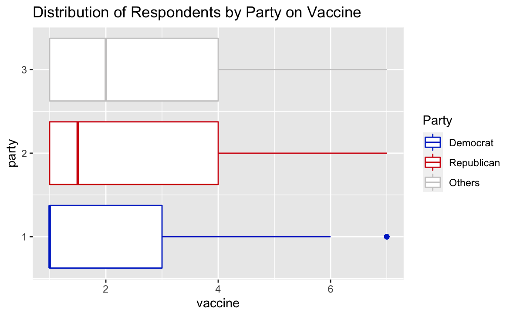

```{r}
#autism
anes_short %>% 
  ggplot(aes(party, autism,
             color = factor(party))) + 
  geom_boxplot() +
  scale_color_manual(values=c(amerika_palettes$Democrat[2],
                              amerika_palettes$Republican[2],
                              amerika_palettes$Dem_Ind_Rep3[2]),
                     name = "Party",
                     breaks=c("1", "2", "3"),
                     labels=c("Democrat", "Republican", "Others")) +
  labs(title = "Distribution of Respondents by Party on Autism") +
  coord_flip()
```

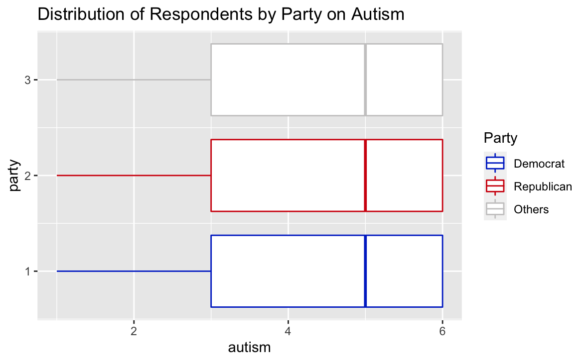

```{r}
#birthright_b
anes_short %>% 
  ggplot(aes(party, birthright_b,
             color = factor(party))) + 
  geom_boxplot() +
  scale_color_manual(values=c(amerika_palettes$Democrat[2],
                              amerika_palettes$Republican[2],
                              amerika_palettes$Dem_Ind_Rep3[2]),
                     name = "Party",
                     breaks=c("1", "2", "3"),
                     labels=c("Democrat", "Republican", "Others")) +
  labs(title = "Distribution of Respondents by Party on Birthright") +
  coord_flip()
```

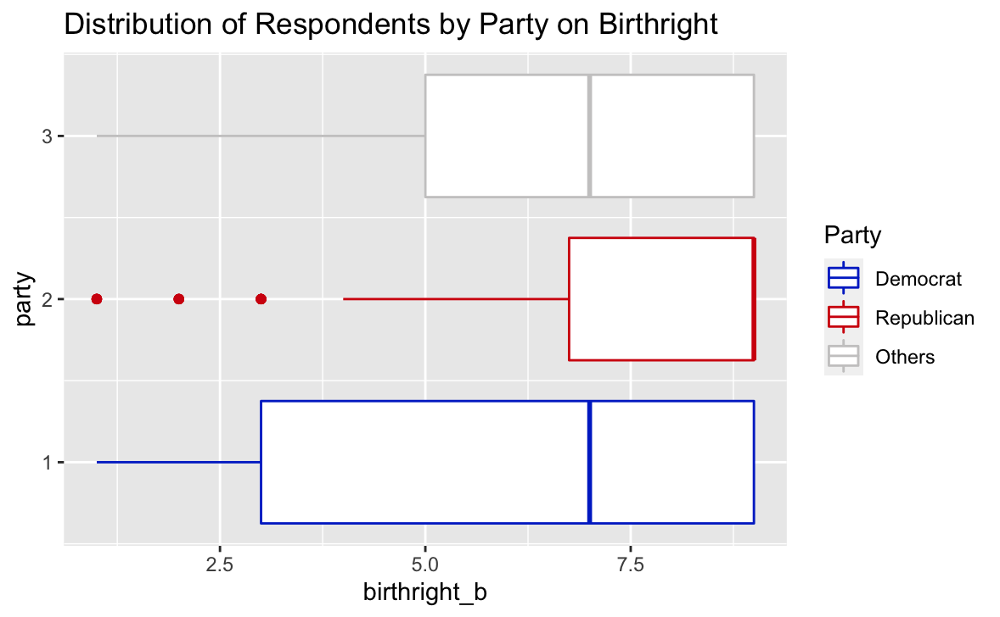

```{r}
#forceblack
anes_short %>% 
  ggplot(aes(party, forceblack,
             color = factor(party))) + 
  geom_boxplot() +
  scale_color_manual(values=c(amerika_palettes$Democrat[2],
                              amerika_palettes$Republican[2],
                              amerika_palettes$Dem_Ind_Rep3[2]),
                     name = "Party",
                     breaks=c("1", "2", "3"),
                     labels=c("Democrat", "Republican", "Others")) +
  labs(title = "Distribution of Respondents by Party on Forceblack") +
  coord_flip()

```

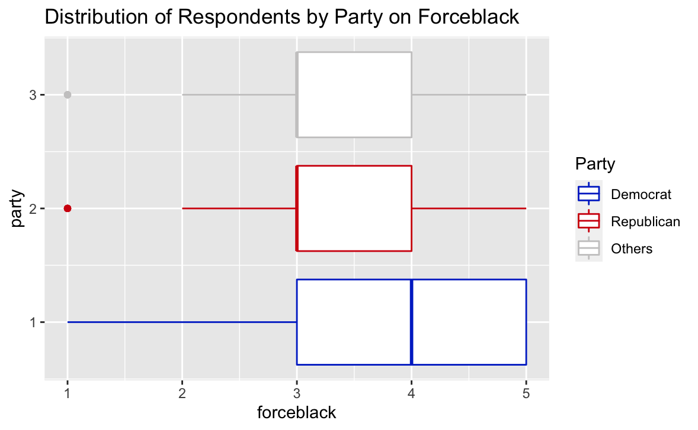

```{r}
#forcewhite
anes_short %>% 
  ggplot(aes(party, forcewhite,
             color = factor(party))) + 
  geom_boxplot() +
  scale_color_manual(values=c(amerika_palettes$Democrat[2],
                              amerika_palettes$Republican[2],
                              amerika_palettes$Dem_Ind_Rep3[2]),
                     name = "Party",
                     breaks=c("1", "2", "3"),
                     labels=c("Democrat", "Republican", "Others")) +
  labs(title = "Distribution of Respondents by Party on Forcewhite") +
  coord_flip()
```

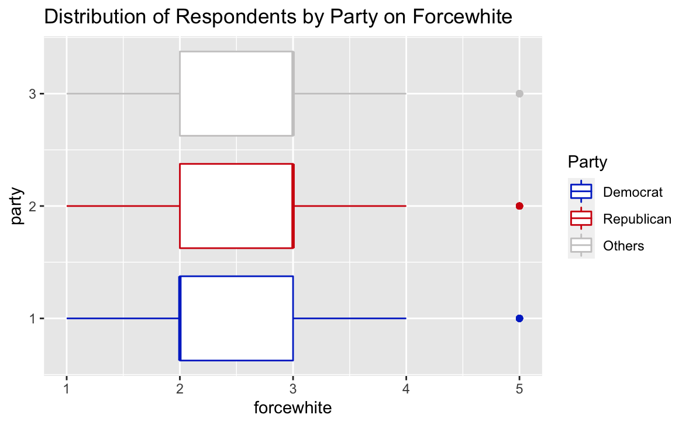

```{r}
#stopblack
anes_short %>% 
  ggplot(aes(party, stopblack,
             color = factor(party))) + 
  geom_boxplot() +
  scale_color_manual(values=c(amerika_palettes$Democrat[2],
                              amerika_palettes$Republican[2],
                              amerika_palettes$Dem_Ind_Rep3[2]),
                     name = "Party",
                     breaks=c("1", "2", "3"),
                     labels=c("Democrat", "Republican", "Others")) +
  labs(title = "Distribution of Respondents by Party on Stopblack") +
  coord_flip()
```

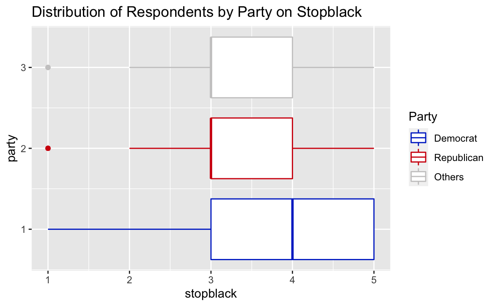

```{r}
#stopwhite
anes_short %>% 
  ggplot(aes(party, stopwhite,
             color = factor(party))) + 
  geom_boxplot() +
  scale_color_manual(values=c(amerika_palettes$Democrat[2],
                              amerika_palettes$Republican[2],
                              amerika_palettes$Dem_Ind_Rep3[2]),
                     name = "Party",
                     breaks=c("1", "2", "3"),
                     labels=c("Democrat", "Republican", "Others")) +
  labs(title = "Distribution of Respondents by Party on Stopwhite") +
  coord_flip()
```

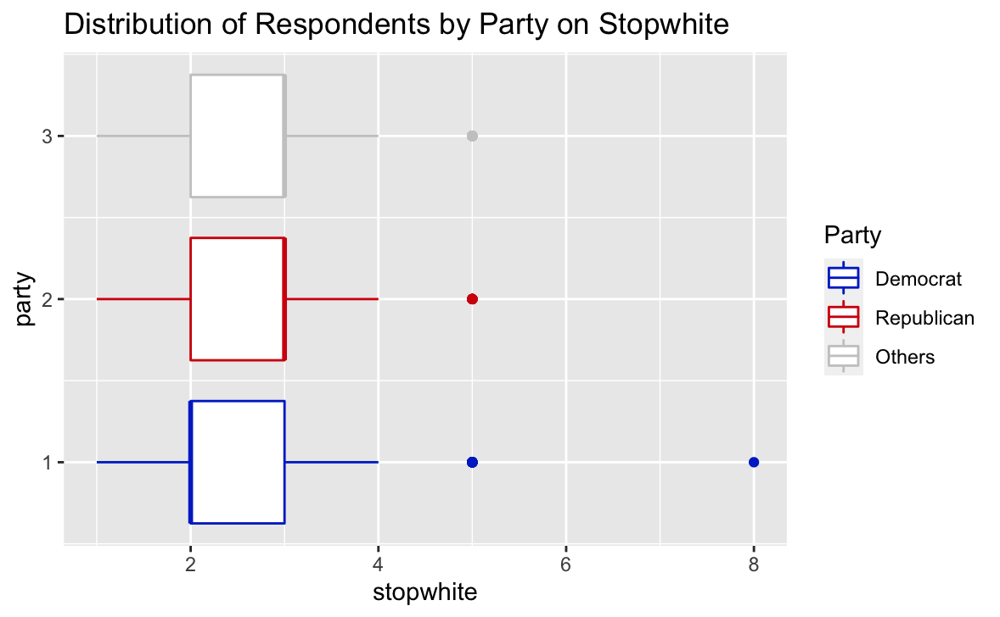

```{r}
#freetrade
anes_short %>% 
  ggplot(aes(party, freetrade,
             color = factor(party))) + 
  geom_boxplot() +
  scale_color_manual(values=c(amerika_palettes$Democrat[2],
                              amerika_palettes$Republican[2],
                              amerika_palettes$Dem_Ind_Rep3[2]),
                     name = "Party",
                     breaks=c("1", "2", "3"),
                     labels=c("Democrat", "Republican", "Others")) +
  labs(title = "Distribution of Respondents by Party on Freetrade") +
  coord_flip()

```

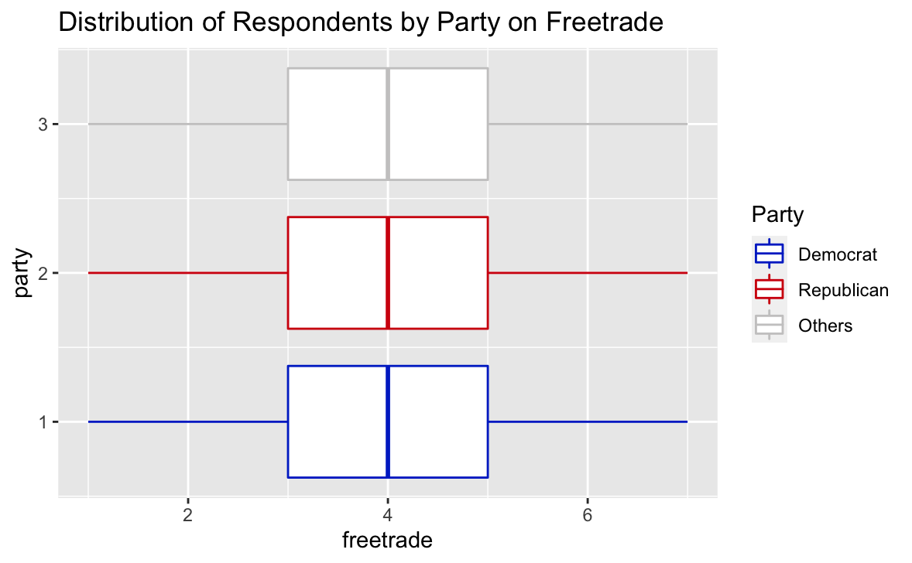

```{r}
#aa3
anes_short %>% 
  ggplot(aes(party, aa3,
             color = factor(party))) + 
  geom_boxplot() +
  scale_color_manual(values=c(amerika_palettes$Democrat[2],
                              amerika_palettes$Republican[2],
                              amerika_palettes$Dem_Ind_Rep3[2]),
                     name = "Party",
                     breaks=c("1", "2", "3"),
                     labels=c("Democrat", "Republican", "Others")) +
  labs(title = "Distribution of Respondents by Party on AA3") +
  coord_flip()
```

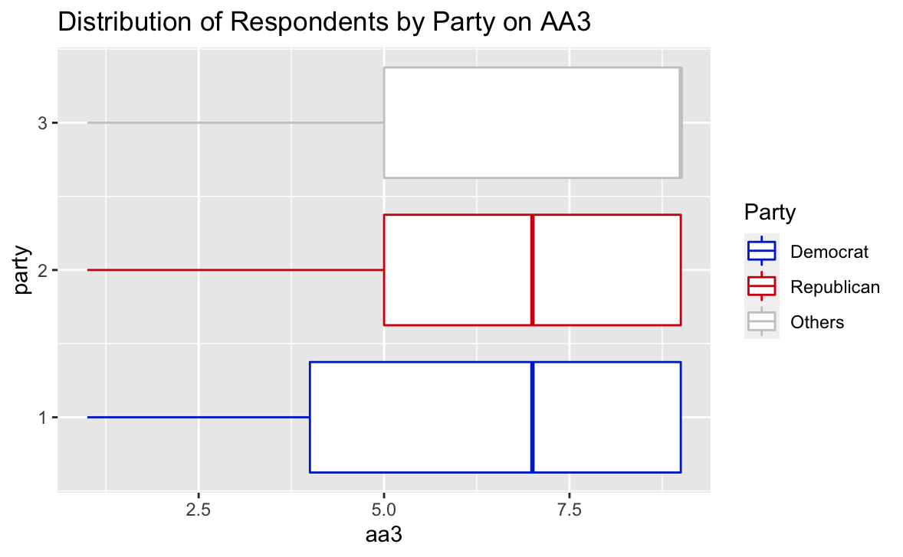

```{r}
#warmdo
anes_short %>% 
  ggplot(aes(party, warmdo,
             color = factor(party))) + 
  geom_boxplot() +
  scale_color_manual(values=c(amerika_palettes$Democrat[2],
                              amerika_palettes$Republican[2],
                              amerika_palettes$Dem_Ind_Rep3[2]),
                     name = "Party",
                     breaks=c("1", "2", "3"),
                     labels=c("Democrat", "Republican", "Others")) +
  labs(title = "Distribution of Respondents by Party on Warmdo") +
  coord_flip()
```

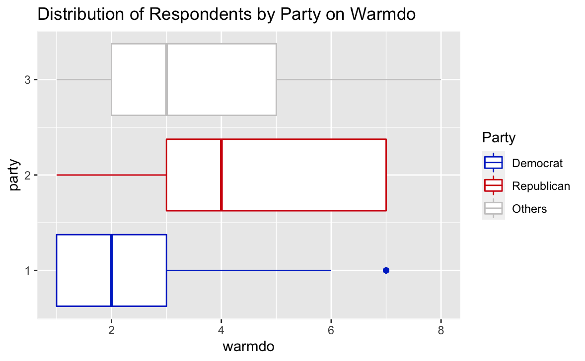

```{r}
#finwell
anes_short %>% 
  ggplot(aes(party, finwell,
             color = factor(party))) + 
  geom_boxplot() +
  scale_color_manual(values=c(amerika_palettes$Democrat[2],
                              amerika_palettes$Republican[2],
                              amerika_palettes$Dem_Ind_Rep3[2]),
                     name = "Party",
                     breaks=c("1", "2", "3"),
                     labels=c("Democrat", "Republican", "Others")) +
  labs(title = "Distribution of Respondents by Party on Finwell") +
  coord_flip()
```

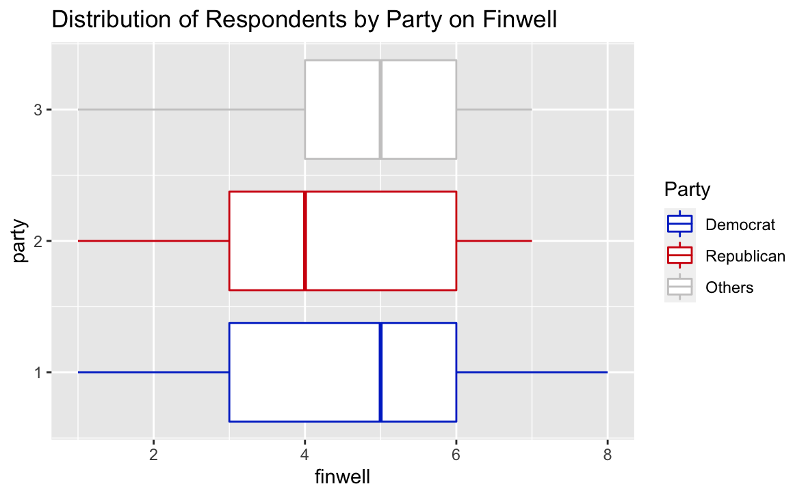

```{r}
#childcare
anes_short %>% 
  ggplot(aes(party, childcare,
             color = factor(party))) + 
  geom_boxplot() +
  scale_color_manual(values=c(amerika_palettes$Democrat[2],
                              amerika_palettes$Republican[2],
                              amerika_palettes$Dem_Ind_Rep3[2]),
                     name = "Party",
                     breaks=c("1", "2", "3"),
                     labels=c("Democrat", "Republican", "Others")) +
  labs(title = "Distribution of Respondents by Party on Childcare") +
  coord_flip()
```

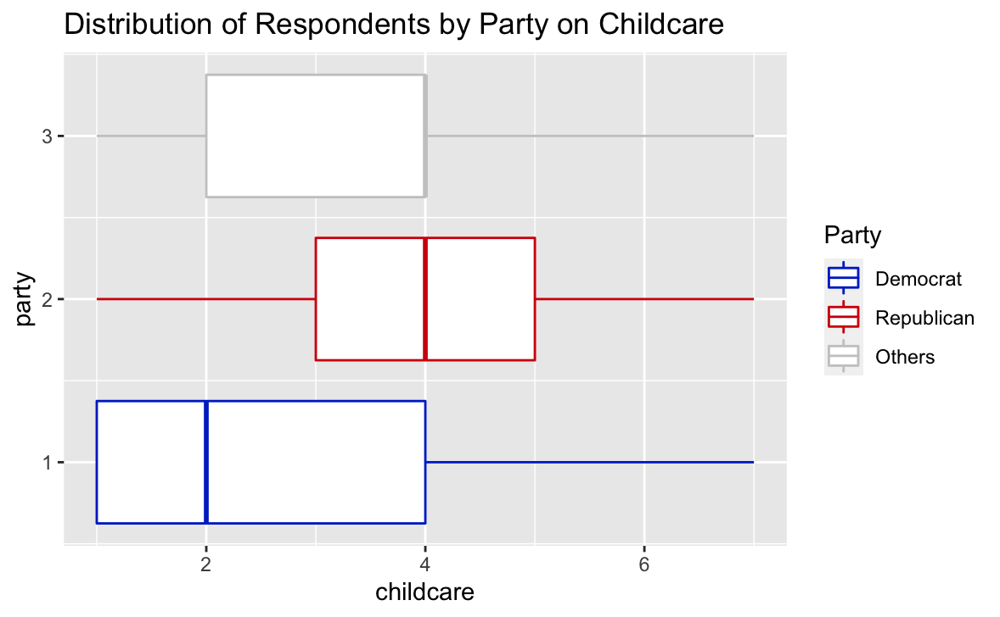

```{r}
#healthspend
anes_short %>% 
  ggplot(aes(party, healthspend,
             color = factor(party))) + 
  geom_boxplot() +
  scale_color_manual(values=c(amerika_palettes$Democrat[2],
                              amerika_palettes$Republican[2],
                              amerika_palettes$Dem_Ind_Rep3[2]),
                     name = "Party",
                     breaks=c("1", "2", "3"),
                     labels=c("Democrat", "Republican", "Others")) +
  labs(title = "Distribution of Respondents by Party on Healthspend") +
  coord_flip()
```

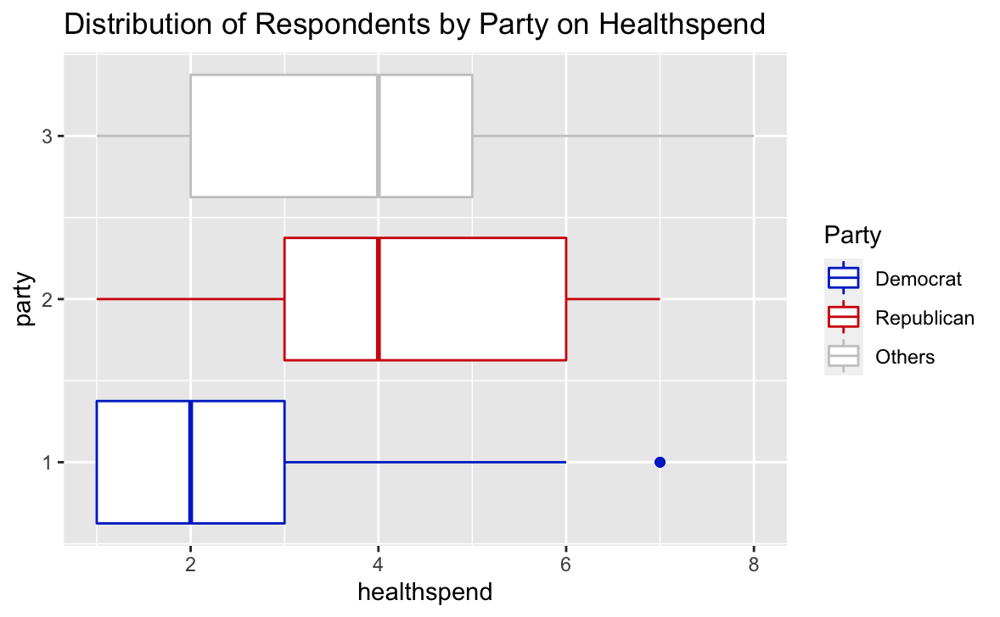

```{r}
#minwage
anes_short %>% 
  ggplot(aes(party, minwage,
             color = factor(party))) + 
  geom_boxplot() +
  scale_color_manual(values=c(amerika_palettes$Democrat[2],
                              amerika_palettes$Republican[2],
                              amerika_palettes$Dem_Ind_Rep3[2]),
                     name = "Party",
                     breaks=c("1", "2", "3"),
                     labels=c("Democrat", "Republican", "Others")) +
  labs(title = "Distribution of Respondents by Party on Minwage") +
  coord_flip()
```

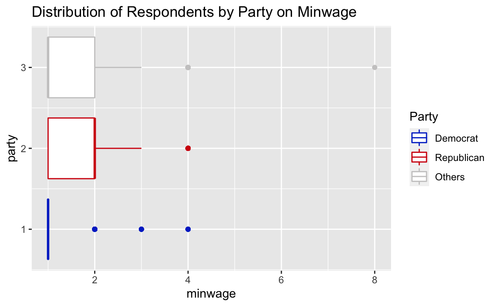

4.  Construct and present a self-organizing map (SOM) of the *question space*. **Think carefully about the scale of response categories, as these vary across questions.** Also, remember to tune the relevant hyperparameters appropriately. You might consider the `kohonen` package in R (though there are many others), or the `minisom` package in Python. A response to this may include creating grids, fitting models, and creating (multiple) visualizations of the results.

```{r}
anes_scaled <- anes_short %>% 
  select(-party) %>% 
  scale()

set.seed(1234)
library(kohonen)

# create the structure of the output layer
search_grid <- somgrid(xdim = 10, 
                       ydim = 10, 
                       topo = "rectangular",
                       neighbourhood.fct = "gaussian") 

#fit 
som_fit <- som(anes_scaled,
               grid = search_grid,
               alpha = c(0.1, 0.001), 
               radius = 1, 
               rlen = 500, 
               dist.fcts = "euclidean", 
               mode = "batch") 

plot(som_fit) 

som_fit$changes %>% 
  as_tibble() %>% 
  mutate(changes = V1,
         iteration = seq(1:length(changes))) %>% 
  ggplot(aes(iteration, changes)) +
  geom_line() +
  labs(x = "Training Iteration",
       y = "Mean Distance to Closest Node") +
  theme_minimal()


plot(som_fit, type = "dist.neighbours")
```

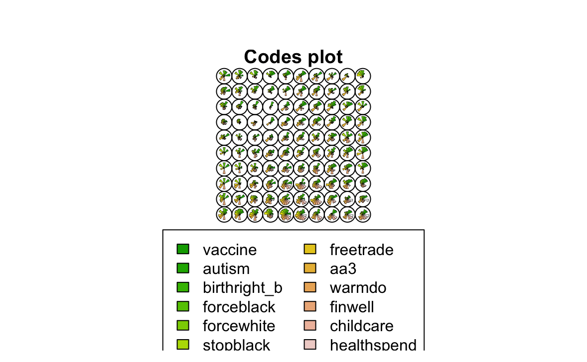

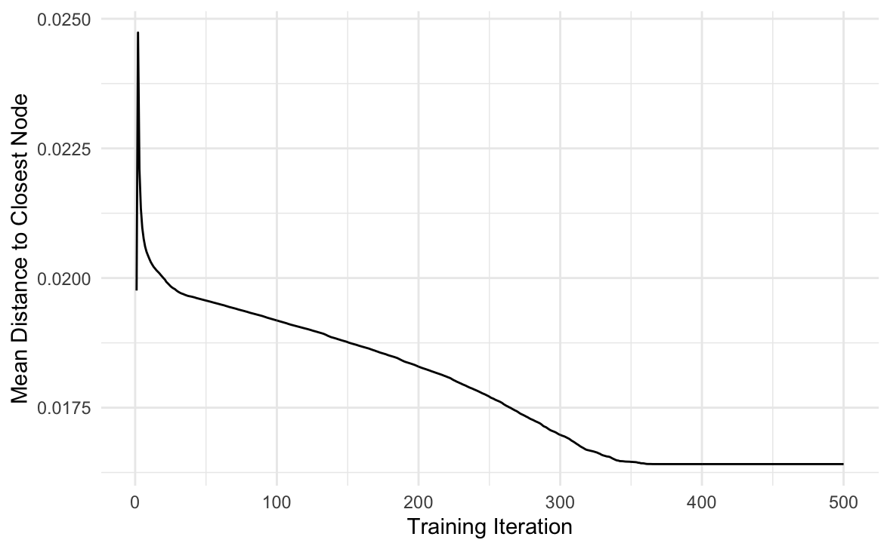

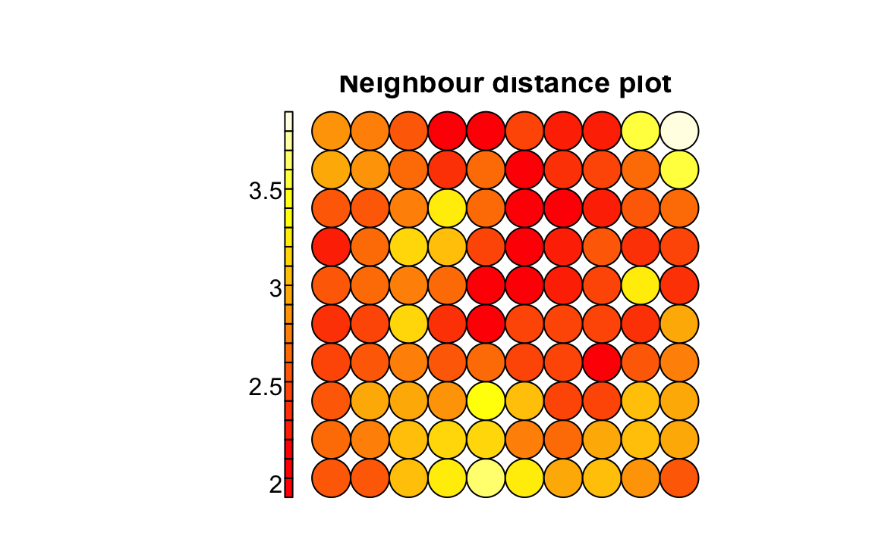

5.  Comment on the results thus far as it relates to the main goal of the task. In other words, did you uncover evidence of partisan differences in the data? Did you not? Regardless, why do you think you got the results you did? What are some other substantive patterns you detected?

-   SOMs are a class of unsupervised learning neural network used for dimension reduction, feature engineering, clustering, and etc. I have used the Kohonen learning to convert a complex high dimensional input layer into a low-dimensional map. The SOMS structured the output into clusters of nodes where clusters are formed based on spatial proximity and similarities. Looking at the graph above, as we train the data, the distance between the closet nodes -- the correlation between the weight factor -- becomes progressively smaller, which is unsurprising. Although it is difficult to read the codes plot, combined with the neighbor distance plot, there seems to have some evidence of partisan difference in the data.

6.  To validate the SOM results, fit a k-means algorithm to the data and plot respondents' political party affiliations as well as their cluster assignments from the k-means fit. Discuss the results. E.g., Do you see evidence of partisan differences across the groups? Do you not? How do you know?

```{r}

point_colors <- c(amerika_palettes$Republican[2], 
                  amerika_palettes$Democrat[2],
                  amerika_palettes$Dem_Ind_Rep3[2])

neuron_colors <- c(amerika_palettes$Republican[3], 
                   amerika_palettes$Democrat[3],
                   amerika_palettes$Dem_Ind_Rep3[2])

## k-means
kmeans_clusters <- som_fit$codes[[1]] %>% 
  kmeans(., centers = 3)

class_assign_km <- map_dbl(kmeans_clusters$cluster, ~{
  if(. == 1) 1
  else if(. == 2) 2
  else 3
}
)

plot(som_fit, 
     type = "mapping", 
     pch = 21, 
     bg = point_colors[as.factor(anes_short$party)],
     shape = "straight",
     bgcol = neuron_colors[as.integer(class_assign_km)],
     main = "3 clusters via k-means with som_fit"); add.cluster.boundaries(x = som_fit, 
                                                                           clustering =class_assign_km,
                                                                           lwd = 5, lty = 5)


```

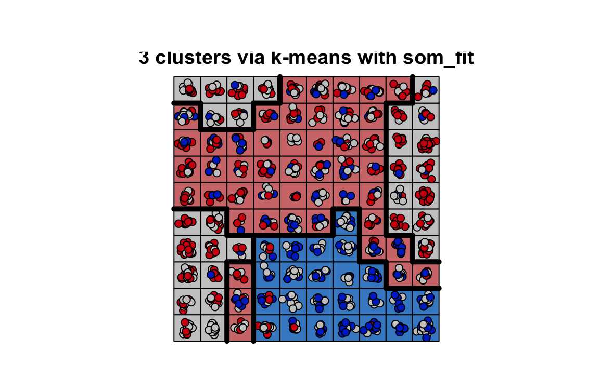

-   The intuition we want to explore is whether the codes naturally group in
    substantive dimension. Thus, we fitted k-means algorithm to the codes data. We
    searched for three clusters -- democrats, republicans, and others. The result shows
    true class labels and background shows the nodes, or the correlations that exist
    across each one of the features where they project the space. The plot shows there is
    some evidence of partisan differences across the groups, as the true class labels
    decently match the background.

7.  Taken with the SOM results, do the k-means results show similar or different patterns? Or is it unclear? Discuss both models in relation to each other for a full, well-rounded validation. *Note*: you are encouraged to think of and implement other ways to validate your results. You are welcome to go back to class notes, Google, etc.

-   Taken with the SOM results, the k-means results do seem to show similar patterns.
