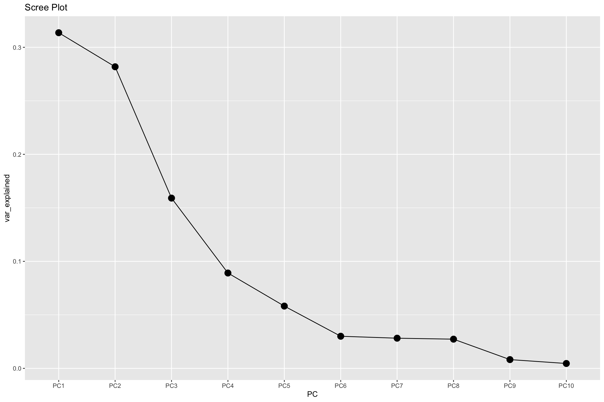
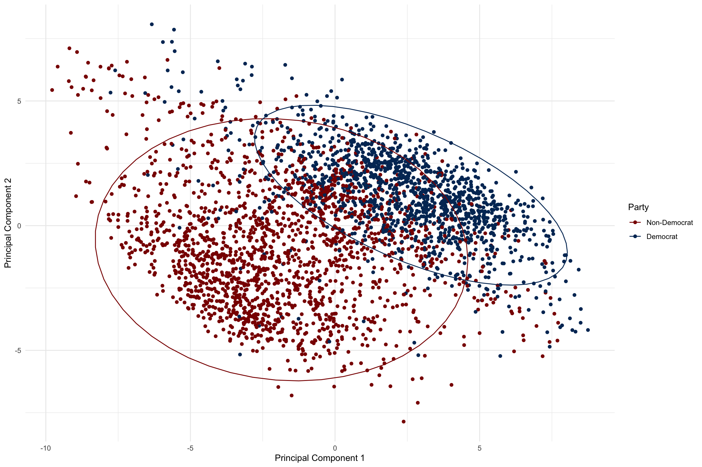
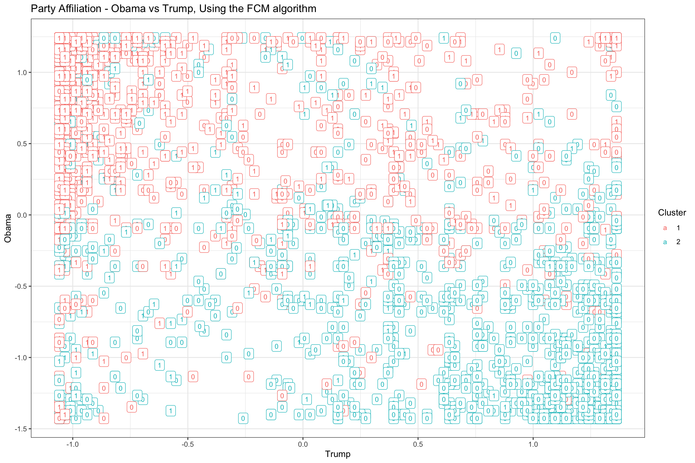

## Unsupervised Learning

## Dimension Reduction

### Conceptual Problems

1.  (5 points) Compute the total variance from the following PCA output.

|                    | PC1  | PC2  | PC3  | PC4  | PC5  | PC6  | PC7  | PC8  | PC9  | PC10 |
|:------------------:|:----:|:----:|:----:|:----:|:----:|:----:|:----:|:----:|:----:|:----:|
| Standard deviation | 3.55 | 2.41 | 1.82 | 1.31 | 1.05 | 0.86 | 0.81 | 0.79 | 0.72 | 0.70 |
|      Variance      | 3.45 | 3.10 | 1.75 | 0.98 | 0.64 | 0.33 | 0.31 | 0.30 | 0.09 | 0.05 |

```{r}
variance <- c(3.45, 3.10, 1.75, 0.98, 0.64, 0.33, 0.31, 0.30, 0.09, 0.05)
total_variance <-sum(variance)
total_variance
```

2.  (10 points) Make a *manual* scree plot based on these results. That is, *no* canned functions or packages (e.g., `factoextra`).

```{r}
stdev <- c(3.55, 2.41, 1.82, 1.31, 1.05, 0.86, 0.81, 0.79, 0.72, 0.70)

var_explained_df <- data.frame(PC = paste0("PC", 1:10),
                               var_explained = (variance)/total_variance)

library(ggplot2)
library(tidyverse)
library(dplyr)

var_explained_df %>% 
  mutate(PC = factor(PC, levels = PC)) %>% 
  ggplot(aes(x = PC, y = var_explained, group = 1))+
  geom_point(size = 4)+
  geom_line()+
  labs(title = "Scree Plot")
```



3.  (10 points) Based on your results in the previous question, how many PCs would you suggest characterize these data well? That is, what would the dimensionality of your new reduced data space be?

-   Using PCA to derive lower dimensional representation of the higher dimensional data, we get some useful information, such as loadings, scores, and proportion of variance explained. Eyeballing the scree plot above, I would suggest that the first three principal components explain fair amount of variance, yet the third principal component explains less. Each succeeding component from the fourth principal to the tenth principal component explains less than ten percent of the variance in the data. Thus, we would consider the fourth principal and each succeeding component of little to no value.

4.  (10 points) Calculate the Euclidean distance between each of the following observations, $i$, and some observation at 0 (i.e., $x_0$) in 4-dimensional space $\forall X \in \{1,2,3,4\}$.

| $i$ | $X_1$ | $X_2$ | $X_3$ | $X_4$ | Euclidean Distance |
|:---:|:-----:|:-----:|:-----:|:-----:|:------------------:|
|  1  |   2   |   2   |   3   |   1   |      $\dots$       |
|  2  |   1   |   1   |  -2   |   2   |      $\dots$       |
|  3  |   1   |  -2   |  -2   |  -1   |      $\dots$       |
|  4  |   3   |   3   |   2   |   2   |      $\dots$       |
|  5  |  -3   |   2   |  -1   |   1   |      $\dots$       |

```{r}
obs <- data.frame(x0 = c(0, 0, 0, 0, 0),
                  x1 = c(2, 1, 1, 3, -3),
                  x2 = c(2, 1, -2, 3, 2),
                  x3 = c(3, -2, -2, 2, -1),
                  x4 = c(1, 2, -1, 2, 1))

euc_dist <- dist(obs, method = "euclidean", diag = T)
euc_dist
```

### An Applied Problem

For the following applied problem, use the 2019 American National Election Study (ANES) Pilot survey data. These data include, among many other features, a battery of 35 feeling thermometers, which are questions with answers ranging from 1 to 100 for how respondents "rate" some topic (e.g., *How would you rate Obama?* or *How would you rate Japan?*). See the documentation and more detail [here.](https://electionstudies.org/data-center/2019-pilot-study/)

To make your lives a bit easier, I have preprocessed the data for you, including: 1) feature engineering (via kNN) for missing data, and 2) reduction of the feature space to include only the 35 feeling thermometers and a feature for the respondent's party affiliation (`democrat`), where 1 = Democrat and 0 = non-Democrat (which could be Republican, Independent, or decline to say).

5.  (10 points) Fit a PCA model on all 35 feeling thermometers from the 2019 ANES, but be careful to *not* include the party affiliation feature.

```{r}
anes <- readRDS("anes.rds")

pca_fit <- anes[,-36] %>%
  scale() %>% 
  prcomp(); summary(pca_fit)
```

6.  (20 points) Plot the feature contributions from each of the feeling thermometers in the first two dimensions (i.e., PC1 and PC2). Describe the patterns, groupings, and structure of the lower-dimensional projections in *substantive* terms.

```{r}
library(tidyverse)
library(corrr)
library(amerika)
library(factoextra)
library(patchwork)
library(ggrepel)

pca_fit %>% 
  fviz_pca_var(col.var = "contrib") +
  scale_color_gradient(high = amerika_palettes$Democrat[1], 
                       low = amerika_palettes$Republican[1]) +
  labs(color = "Contribution",
       title = "The Feature Contributions in the First Two Dimensions") +
  theme_minimal()
```


-   Feature loadings are essentially correlations between each feature and each dimensions (principal components). The first quadrant displays who are considered more liberal/democrat, and the third quadrant displays more conservatives/republican. Trump, NRA, and ICE are negatively correlated with the first and second principal component, while features on the first quadrant such as Obama and Biden shows positive correlations with the first and second principal components. Examining the features in relation to each other, feature loadings for Trump, NRA, and ICE are opposite of the feelings towards Obama, Biden, and so on.

```{r}
anes %>% 
  ggplot(aes(pca_fit$x[, 1],
             pca_fit$x[, 2], 
             col = factor(democrat))) +
  geom_point() +
  stat_ellipse() +
  scale_color_manual(values=c(amerika_palettes$Republican[1], 
                              amerika_palettes$Democrat[1]),
                      name="Party",
                      breaks=c("0", "1"),
                      labels=c("Non-Democrat", "Democrat")) +
  labs(x = "Principal Component 1",
       y = "Principal Component 2") +
  theme_minimal()
```



-   If we look further: in general, non-democrats are separated from democrats in the projection space. They definitely do have difference between first and second principal component on the partisan dimension. But we do see some overlaps. These overlaps can be explained perhaps because non-democrats includes republics, independents, green party, etc.

## Clustering

### A Conceptual Problem

7.  (10 points) What are the two properties required for a *hard* partitional solution, and when thus relaxed, give a *soft* partitional clustering solution? Be sure to answer this both formally (with mathematical notation) and substantively (with words). Then, give an example or two of each and how they relate to these two central properties of clustering.

-   Hard partitioning algorithm requires strict assignment such that every observations is a member of only one cluster. Each data point either belongs to a cluster completly or not and must satisfy two properties: 1) Each observations belong to one of the kth clusters such that 2) Clusters are non-overlapping such that. Hard partitioning algorithms include k-means, On the otherhand, in soft partitiong, observations are given probabilities belonging to all clusters and are then partitioned on the basis of probabilitistic similarities. Overlapping clusters are allowed. Soft partiioning algorithms include the EM and the Fuzzy C-means algorithms.

### An Applied Problem

In this applied problem, you will again use the 2019 ANES data, but this time to explore the clustering solution from fitting a fuzzy c-means (FCM) algorithm to all feeling thermometers. As with the dimension reduction exercise, derive a clustering solution using *only* the feeling thermometers. The idea here is to explore whether attitudes on these issues, countries, and people map onto natural groupings between major American political parties.

8.  (5 points) Load and scale the ANES *feeling thermometer* data.

```{r}
anes <- readRDS("anes.rds")

anes_scaled <- anes[, 1:35] %>% 
  scale() %>% 
  as_tibble() 
```

9.  (5 points) Fit an FCM algorithm to the scaled data initialized at $k = 2$, driven by the assumption that party affiliation (Democrat or non-Democrat) underlies these data.

```{r}
library('e1071')

cm <- cmeans(anes_scaled, centers = 2, m = 2)
```

10. (15 points) Visualize the cluster scores from your FCM solution plotted over the range of feelings toward `Trump` and `Obama`, with data points colored by cluster assignment and also labeled by the respondent's true party affiliation (the `democrat` feature). As party wasn't included in your clustering solution, what can you conclude based on these patterns? Is there a grouping pattern among observations along a partisan dimension, or isn't there? Do respondents group in expected ways (e.g., Trump supporters to the right and Obama supporters to the left)? Do cluster assignments align with the true party affiliation or not? How would you evaluate the effectiveness of FCM for this type of task?

```{r}
anes_scaled$Cluster <- cm$cluster 
anes_scaled$Cluster <- as.factor(ifelse(anes_scaled$Cluster == 1, 2, 1))
anes_scaled

anes_scaled$democrat <- anes$democrat
anes_scaled

anes_scaled %>% 
  ggplot(aes(x = Trump, y = Obama, label = democrat, color = Cluster)) +
    geom_jitter() +
  geom_label(aes(label = democrat, color = Cluster), size = 3) + 
  labs(title = "Party Affiliation - Obama vs Trump, Using the FCM algorithm") + 
  theme_bw()
```


